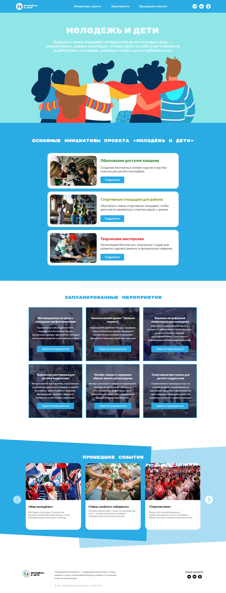

# README — English / Русский

This file is available in two languages: English and Russian.  
Данный файл доступен на двух языках: английском и русском.

---

## 🇬🇧 English

# Youth & Children — Social Projects Platform

## Description
A student project website for youth and children's initiatives. The design is inspired by the official Russian national projects website (национальныепроекты.рф), adapted for a youth-focused audience.

The site features a hero banner, initiative cards with pop-up details, an event calendar with registration forms, past events slider, and a footer with social media links.

This project was created as part of a college assignment to practice complex interactivity, form validation, pop-ups, and responsive layout.

> **Design reference**: The structure and visual style are inspired by национальныепроекты.рф for educational purposes.

## Technologies Used
- HTML5
- CSS3 (Flexbox, Grid)
- JavaScript (vanilla, no libraries)

## Features

### Navigation & Header
- Fully working menu
- Logo linking to the homepage
- Social media icons with hover animation (shift upward on hover)

### Hero Banner
- Inspirational text about youth shaping the future

### Key Initiatives
- 3 vertical cards: "Education for Everyone", "Sports Facilities", "Creative Workshops"
- Each card has a "Details" button → opens a pop-up with full project information

### Upcoming Events
- 6 event cards with detailed information
- "Register" button → opens a registration pop-up with a form
- Form validation: checks for incorrect email format and empty fields
- "Clear" button to reset the form
- Form submission is demo-only (no data sent)

### Past Events
- 6-card slider with completed events

### Footer
- Logo
- Project description
- Copyright notice
- Social media icons (non-functional, demo)

## Planned Improvements
- Connect registration form to a backend (Node.js)
- Add event filtering by category or date
- Implement a personal account for users
- Make social media icons functional
- Add more events and expand content
- Improve slider accessibility and performance

## Screenshot

---

## 🇷🇺 Русский

# Молодёжь и дети — Платформа социальных проектов

## Описание
Учебный проект — сайт для молодёжных и детских инициатив. Дизайн вдохновлён официальным сайтом национальных проектов России (национальныепроекты.рф) и адаптирован под молодёжную аудиторию.

На сайте представлены баннер, карточки инициатив с всплывающими окнами, календарь мероприятий с формами регистрации, слайдер прошедших событий и подвал с соцсетями.

Проект создан в рамках учебного задания для отработки сложной интерактивности, валидации форм, попапов и адаптивной вёрстки.

> **Источник вдохновения**: Структура и визуальный стиль вдохновлены сайтом национальныепроекты.рф в образовательных целях.

## Используемые технологии
- HTML5
- CSS3 (Flexbox, Grid)
- JavaScript (чистый, без библиотек)

## Функциональность

### Шапка и навигация
- Полностью работающее меню
- Логотип, ведущий на главную
- Иконки соцсетей с анимацией при наведении (смещение вверх)

### Баннер
- Вдохновляющий текст о роли молодёжи в будущем страны

### Основные инициативы
- 3 вертикальные карточки: «Образование доступно каждому», «Спортивные площадки», «Творческие мастерские»
- У каждой карточки кнопка «Подробнее» → открывается попап с полным описанием проекта

### Запланированные мероприятия
- 6 карточек мероприятий с подробной информацией
- Кнопка «Зарегистрироваться» → открывается попап с формой регистрации
- Валидация формы: проверка email, обязательные поля
- Кнопка «Очистить форму» для сброса данных
- Отправка формы — демо (данные никуда не уходят)

### Прошедшие события
- Слайдер из 6 карточек с завершёнными мероприятиями

### Подвал
- Логотип
- Описание проекта
- Копирайт
- Иконки соцсетей (не работают, демо)

## Планы по доработке
- Подключить форму регистрации к бэкенду (Node.js)
- Добавить фильтрацию мероприятий по категориям или датам
- Реализовать личный кабинет для пользователей
- Сделать рабочие соцсети
- Расширить контент (больше мероприятий)
- Улучшить слайдер (пагинация, автопрокрутка)

## Скриншот

